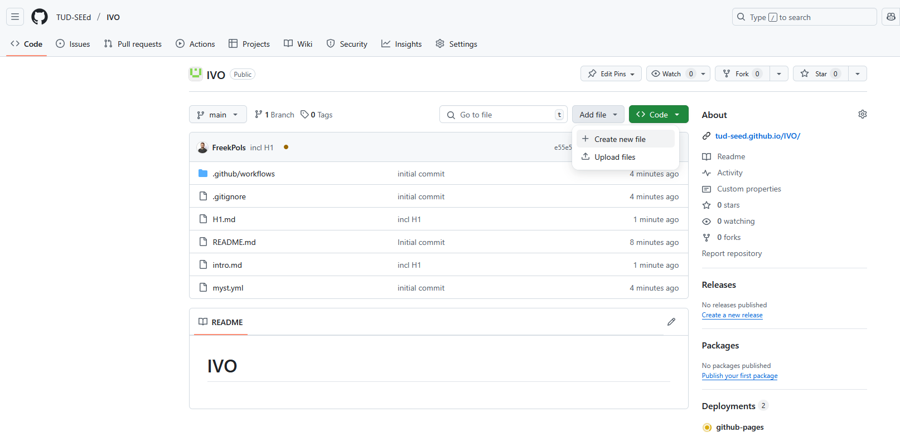
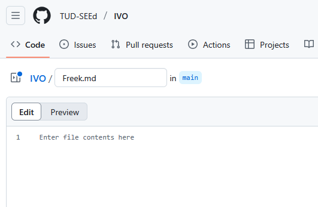

# How to

## Introductie

Welkom bij Jupyter Book! 

* Ga naar de website van [Github](https://github.com) en maak een account aan als je dat nog niet hebt.
* Geef je accountnaam door aan Freek, hij voegt jou toe aan het boek.
* Als je toegang hebt, kun je aan de slag met een eigen hoofdstuk maken of een bestaand hoofdstuk editen. De repo waar je toegang toe krijgt vind je [hier](https://github.com/FreekPols/Mechanica).
* Ga naar de folder *studentenwerk* en klik op *Add file* en *Create a new file*, zie hieronder.



* Geef je file een naam met als extensie *.md* bijv. *Freek.md*



* In die file kun je jouw inhoud stoppen / ontwikkelen. 
* Maak een hoofdstuk titel (# Mijn eerste titel) en een section titel (## Mijn eerste sectie). 
* Druk op de groene *Commit changes* knop om je aanpassingen door te zetten naar de repo. Je kunt de commit een passende titel geven (of niet).

Wat er nu gebeurd is dat het boek opnieuw gemaakt wordt en via GitHub pages gepubliceerd. Na ongeveer 2 minuten kun je dus het resultaat op de website zien!

* Bekijk eens op de site van [Jupyter Book](https://jupyterbook.org/en/stable/content/index.html) naar wat je allemaal kunt toevoegen en pas dat aan in je eigen gemaakte hoofdstuk: klik daartoe op je gemaakte hoofdstuk en dan op het pennetje aan de rechterkant (*edit this file*)
* Je kunt natuurlijk ook de features bekijken in het volgende hoofdstuk.
* Succes!

```{note}
Goed om te weten... dit boek is gemaakt in [MyST](https://mystmd.org/guide) de meest recente versie van Jupyter Books.
```

## Feedback / issue report / vragen
Rechtsboven op de page staat een knop met feedback. Wanneer je daar op klikt kom je op de github van het boek. Je kunt een nieuwe issue aanmaken (groene knop, *New issue*). Daarmee kom je bij een formulier die vraagt om een titel, en een beschrijving van het probleem. Je kunt verder iemand aanwijzen (*assignees*) om het probleem te koppelen aan iemand die het waarschijnlijk kan oplossen. Daarnaast is er de mogelijkheid om een label er aan te hangen (bijv. bug / invalid / help wanted). 

Wanneer je de issue hebt gerapporteerd (Create) belandt deze in de to-do list en wordt het issue opgepakt wanneer daar tijd voor is.
 
Wil je tekeningen bij een specifiek onderwerp, tag dan Hanna. Beschrijf wat je voor tekening wilt, als dat onvoldoende helder is vanuit de vraagstelling zelf.

## Opzetten van een lokale server

Om direct te output van de wijzigingen te zien (lokaal), open je via de terminal de folder en typ je `myst start`. Op dat moment worden de boeken geconverteerd naar een website, welke lokaal te zien is. Het adres wordt gegeven in de terminal, veelal is dat: `http://localhost:3000`. Via een webbrowser kan dit adres gekopieerd worden. Wanneer je een bestand opslaat, wordt deze binnen ~5 s zichtbaar.

## Werken met GIT
VOor je start:  
VSC - git pull

Als je klaar bent:  
comment toevoegen (samenvatting)
en commit & push

